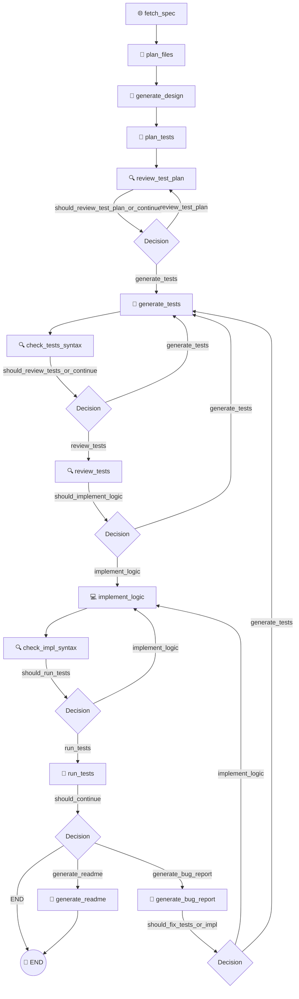

# TDDRobo: AI Agent Architecture (`AGENTS.md`)

TDDRobo is an autonomous agent workflow that builds software using a strict **Test-Driven Development (TDD)** lifecycle. It is powered by **LangGraph** (for workflow orchestration) and **Google GenAI** (with standard and reasoning models).

---

## 🗺️ Workflow Architecture

The entire TDD process is represented as a state machine where nodes execute discrete tasks (agent actions) and conditional edges determine the flow of control (e.g., repeating syntax fixes or debug loops).

---

## 🤖 Node & Agent Responsibilities

The agent uses two models tailored for distinct tasks:
*   **Primary Model (`gemma-4-31b-it`)**: A reasoning-heavy model used for design, logic generation, code reviews, and bug analysis.
*   **Secondary Model (`gemma-4-26b-a4b-it`)**: A faster, standard model used for planning filenames, initial test outlines, and documentation.

### 1. Specification & Design Phase
*   **`fetch_spec`**: Downloads the specification from a URL or reads it from a local file path. It converts HTML pages to clean Markdown to prevent LLM noise.
*   **`plan_files`**: Uses the secondary model to dynamically decide names for the implementation and test scripts.
*   **`generate_design`**: Uses the primary model to draft a Software Design Document matching the specifications.

### 2. Test Planning Phase (Red Phase)
*   **`plan_tests`**: Outlines a list of test cases based on the design and specifications.
*   **`review_test_plan`**: Examines the test plan. If coverage is estimated to be below target threshold, it loops back to append missing cases.
*   **`generate_tests`**: Writes the concrete `pytest` code. It automatically parses mathematical expectations from the test plan and verifies them with the local `bc` utility before writing tests.
*   **`check_tests_syntax`**: Runs a Python syntax check (`flake8`) on the test code. If there are syntax errors, it forces the agent to fix them.
*   **`review_tests`**: Runs a secondary review on the generated test code against the plan.

### 3. Implementation & Debug Phase (Green/Refactor Phase)
*   **`implement_logic`**: Writes the actual code required to pass the test suite.
*   **`check_impl_syntax`**: Runs syntax validation (`flake8`) on the implementation file.
*   **`run_tests`**: Executes `pytest` to verify the code against the tests.
*   **`generate_bug_report`**: If any test fails, it analyzes the failing outputs, creates a `BugReport`, and determines whether the bug is in the test script or the implementation. The workflow loops back accordingly.
*   **`generate_readme`**: Once all tests pass, it generates the project `README.md` and exits successfully.

---

## 📈 State Management (`TDDState`)

The state of the workflow is preserved in `TDDState` (defined in [schema.py](file:///var/home/tnagata/tddrobo_fix/schema.py)), which tracks:
*   `goal`, `spec_url`, `spec_content` (Requirements)
*   `design_doc` (Architecture)
*   `test_plan`, `test_plan_review`, `tests_code`, `test_review` (Testing State)
*   `impl_code` (Application Logic)
*   `test_output`, `bug_report` (QA & Debugging data)
*   `iterations`, `test_iterations` (Loop Counters)
*   `success` (Termination Flag)

---

## 🛠️ Production-Grade Safety & Reliability Features

To make the workflow safe and robust for production, several controls have been implemented:

### 🔒 Dual-Instance Safety & Lock Management
*   **Dynamic Directory Isolation**: The workspace directory is resolved as `artifacts/{session_id}/`. Each run has a separate directory preventing files from being overwritten.
*   **Exclusive Session Locks**: Prior to launching the LangGraph workflow, `cli.py` opens a `.session.lock` file and attempts to establish an exclusive file lock (`fcntl.flock`). If the session is already running in another terminal/background task, it exits immediately with an error to prevent data corruption.

### 📁 Code Iteration History (Backups)
*   To prevent code regressions or losing previous milestones, [agent.py](file:///var/home/tnagata/tddrobo_fix/agent.py) automatically saves snapshots of both implementation and test files into the `history/` subdirectory on every iteration (e.g., `impl_iter001.py`, `test_impl_iter001.py`).

### 📡 Offline & Connection Robustness
*   **MLflow Local Fallback**: When starting, `cli.py` tests TCP connectivity to `http://localhost:5000`. If offline, it automatically falls back to a local SQLite database (`sqlite:///mlflow.db`) preventing startup crashes.
*   **Local Spec Support**: If `--spec-url` points to a local file instead of a web URL, `agent.py` loads it directly, allowing offline use.
*   **Autolog Exception Guards**: All MLflow autolog handlers are wrapped in `try-except` blocks to prevent crash failures due to dependency version mismatches.

### 🛡️ LLM Context Protection (Test Log Truncation)
*   If test suites trigger infinite loops or print verbose dumps, the error output is automatically truncated (capped at `8,000` characters, keeping `2,000` prefix chars and `5,000` suffix chars). This protects the LLM from exceeding token limits.

### 🔄 Auto-Resume Watchdog Wrapper
*   The system includes a shell wrapper, [run_with_auto_resume.sh](file:///var/home/tnagata/tddrobo_fix/run_with_auto_resume.sh), which monitors the execution stdout. If the agent hangs (silent for too long), the wrapper terminates the process and restarts it from the latest LangGraph checkpoint.

### 🧪 Test Coverage Requirements
*   **100% Coverage Principle**: As a strict development standard, test execution with `run_tests.sh` must maintain **100% code coverage** (`--cov-fail-under=100`). Any modifications, refactoring, or new feature implementations must include corresponding test cases to fully cover all execution paths (including error handling, fallback branches, and edge cases) to prevent the test suite from failing.

---

## 🌐 Domain-Agnostic Extensibility

TDDRobo is designed as a domain-agnostic TDD workflow agent that is decoupled from any specific application domain.

*   **Abstraction of Oracle Verification**: The verification utility has been abstracted into `evaluate_math_expression`, eliminating `bc`-specific instructions from the core prompt templates.
*   **De-coupling Domain Knowledge**: Domain-specific implementation hints (such as Taylor series formulas for the `bc` math library) have been completely removed from core files like `prompts.py` and `agent.py`.
*   **Dynamic Domain Tips Injection**: Domain-specific hints are passed externally from the boot script (e.g., `run_bc_demo.py`) using the `--domain-tips` or `--domain-tips-file` CLI arguments. These tips are set in the `domain_tips` field of `TDDState` and dynamically injected into the LLM prompts, allowing the same core agent to build software in entirely different domains (e.g., Web APIs, cryptographic libraries, calculators).
*   **Development Benchmark & Configuration Tuning**: Although TDDRobo aims to be a general-purpose, domain-agnostic agent, the workflow uses the `bc_clone` development task (`run_bc_demo.py` triggered from `run_with_auto_resume.sh`) and Gemma 4 as a benchmark for development. The prompts and state machine logic are generic, but the default configuration values (e.g. timeouts, iteration counts) are tuned to optimize performance for this demo.

