# TDDRobo: AI Agent Architecture (`AGENTS.md`)

TDDRobo is an autonomous agent workflow that builds software using a strict, incremental **Test-Driven Development (TDD)** lifecycle. It is powered by **LangGraph** (for workflow orchestration) and **Google GenAI** (with standard and reasoning models).

---

## 🗺️ Workflow Architecture

The entire TDD process is represented as a state machine where nodes execute discrete tasks (agent actions) and conditional edges determine the flow of control (e.g., repeating syntax fixes, debug loops, or phase transitions).

```mermaid
graph TD
    fetch_spec[🌐 fetch_spec] --> generate_requirements[📋 generate_requirements]
    generate_requirements --> plan_files[📁 plan_files]
    plan_files --> generate_design_initial[📐 generate_design_initial]
    generate_design_initial --> review_design_initial[🔍 review_design_initial]
    review_design_initial -->|should_review_design_initial_or_continue| cond_design_initial{Decision}
    cond_design_initial -->|generate_design_initial| generate_design_initial
    cond_design_initial -->|plan_unit_tests| plan_unit_tests[📝 plan_unit_tests]

    update_design_for_req[📐 update_design_for_req] --> review_design_incremental[🔍 review_design_incremental]
    review_design_incremental -->|should_review_design_incremental_or_continue| cond_design_incremental{Decision}
    cond_design_incremental -->|update_design_for_req| update_design_for_req
    cond_design_incremental -->|plan_unit_tests| plan_unit_tests

    %% Unit Test Phase
    plan_unit_tests --> review_unit_test_plan[🔍 review_unit_test_plan]
    review_unit_test_plan -->|should_review_test_plan_or_continue| cond_unit_plan{Decision}
    cond_unit_plan -->|plan_tests| plan_unit_tests
    cond_unit_plan -->|generate_tests| generate_unit_tests[🧪 generate_unit_tests]
    cond_unit_plan -->|update_design_for_req| update_design_for_req
    
    generate_unit_tests --> check_unit_tests_syntax[🔍 check_unit_tests_syntax]
    check_unit_tests_syntax -->|should_review_unit_tests_or_continue| cond_unit_syntax{Decision}
    cond_unit_syntax -->|generate_unit_tests| generate_unit_tests
    cond_unit_syntax -->|implement_initial_logic| implement_initial_logic[💻 implement_initial_logic]
    
    implement_initial_logic --> check_initial_impl_syntax[🔍 check_initial_impl_syntax]
    check_initial_impl_syntax -->|should_run_unit_tests| cond_unit_impl{Decision}
    cond_unit_impl -->|implement_initial_logic| implement_initial_logic
    cond_unit_impl -->|run_unit_tests| run_unit_tests[🏃 run_unit_tests]
    cond_unit_impl -->|update_design_for_req| update_design_for_req
    
    run_unit_tests -->|should_continue_unit| cond_unit_run{Decision}
    cond_unit_run -->|plan_integration_tests| plan_integration_tests[📝 plan_integration_tests]
    cond_unit_run -->|generate_unit_bug_report| generate_unit_bug_report[🐞 generate_unit_bug_report]
    cond_unit_run -->|END| END((🏁 END))
    
    generate_unit_bug_report -->|should_fix_unit_tests_or_impl| cond_unit_bug{Decision}
    cond_unit_bug -->|implement_initial_logic| implement_initial_logic
    cond_unit_bug -->|generate_unit_tests| generate_unit_tests
    cond_unit_bug -->|analyze_architecture| analyze_architecture[🔍 analyze_architecture]
    
    analyze_architecture -->|should_route_from_audit| cond_audit{Decision}
    cond_audit -->|update_design_for_req| update_design_for_req
    cond_audit -->|implement_initial_logic| implement_initial_logic
    cond_audit -->|implement_integration_logic| implement_integration_logic
    cond_audit -->|implement_regression_logic| implement_regression_logic

    %% Integration Test Phase
    plan_integration_tests --> review_integration_test_plan[🔍 review_integration_test_plan]
    review_integration_test_plan -->|should_review_test_plan_or_continue| cond_integ_plan{Decision}
    cond_integ_plan -->|plan_tests| plan_integration_tests
    cond_integ_plan -->|generate_tests| generate_integration_tests[🧪 generate_integration_tests]
    cond_integ_plan -->|update_design_for_req| update_design_for_req
    
    generate_integration_tests --> check_integration_tests_syntax[🔍 check_integration_tests_syntax]
    check_integration_tests_syntax -->|should_review_integration_tests_or_continue| cond_integ_syntax{Decision}
    cond_integ_syntax -->|generate_integration_tests| generate_integration_tests
    cond_integ_syntax -->|implement_integration_logic| implement_integration_logic[💻 implement_integration_logic]
    
    implement_integration_logic --> check_integration_impl_syntax[🔍 check_integration_impl_syntax]
    check_integration_impl_syntax -->|should_run_integration_tests| cond_integ_impl{Decision}
    cond_integ_impl -->|implement_integration_logic| implement_integration_logic
    cond_integ_impl -->|run_integration_tests| run_integration_tests[🏃 run_integration_tests]
    cond_integ_impl -->|update_design_for_req| update_design_for_req
    
    run_integration_tests -->|should_continue_integration| cond_integ_run{Decision}
    cond_integ_run -->|run_regression_tests| run_regression_tests[🏃 run_regression_tests]
    cond_integ_run -->|generate_integration_bug_report| generate_integration_bug_report[🐞 generate_integration_bug_report]
    cond_integ_run -->|END| END
    
    generate_integration_bug_report -->|should_fix_integration_tests_or_impl| cond_integ_bug{Decision}
    cond_integ_bug -->|implement_integration_logic| implement_integration_logic
    cond_integ_bug -->|generate_integration_tests| generate_integration_tests
    cond_integ_bug -->|analyze_architecture| analyze_architecture

    %% Regression Phase
    run_regression_tests -->|should_continue_regression| cond_reg_run{Decision}
    cond_reg_run -->|decide_refactor| decide_refactor[❓ decide_refactor]
    cond_reg_run -->|increment_requirement| increment_requirement[➡️ increment_requirement]
    cond_reg_run -->|generate_regression_bug_report| generate_regression_bug_report[🐞 generate_regression_bug_report]
    cond_reg_run -->|generate_refactor_bug_report| generate_refactor_bug_report[🐞 generate_refactor_bug_report]
    cond_reg_run -->|END| END

    generate_regression_bug_report -->|should_fix_regression_tests_or_impl| cond_reg_bug{Decision}
    cond_reg_bug -->|implement_regression_logic| implement_regression_logic[💻 implement_regression_logic]
    cond_reg_bug -->|generate_integration_tests| generate_integration_tests
    cond_reg_bug -->|generate_unit_tests| generate_unit_tests
    cond_reg_bug -->|analyze_architecture| analyze_architecture
    cond_reg_bug -->|halt_regression_test_failure| END
    cond_reg_bug -->|END| END

    implement_regression_logic --> check_regression_impl_syntax[🔍 check_regression_impl_syntax]
    check_regression_impl_syntax -->|should_run_regression_tests| cond_reg_impl{Decision}
    cond_reg_impl -->|implement_regression_logic| implement_regression_logic
    cond_reg_impl -->|run_regression_tests| run_regression_tests
    cond_reg_impl -->|update_design_for_req| update_design_for_req

    %% Refactoring Phase
    decide_refactor -->|should_refactor| cond_refactor{Decision}
    cond_refactor -->|refactor_logic| refactor_logic[🧹 refactor_logic]
    cond_refactor -->|increment_requirement| increment_requirement
    
    refactor_logic --> check_refactored_impl_syntax[🔍 check_refactored_impl_syntax]
    check_refactored_impl_syntax -->|should_run_regression_after_refactor| cond_refactor_syntax{Decision}
    cond_refactor_syntax -->|refactor_logic| refactor_logic
    cond_refactor_syntax -->|run_regression_tests| run_regression_tests

    generate_refactor_bug_report -->|should_fix_refactor_or_continue| cond_refactor_bug{Decision}
    cond_refactor_bug -->|refactor_logic| refactor_logic
    cond_refactor_bug -->|increment_requirement| increment_requirement

    %% Advancement
    increment_requirement -->|should_continue_workflow| cond_adv{Decision}
    cond_adv -->|update_design_for_req| update_design_for_req
    cond_adv -->|generate_readme| generate_readme[📝 generate_readme]
    
    generate_readme --> END
```



---

## 🤖 Node & Agent Responsibilities

The agent uses two models tailored for distinct tasks:
*   **Primary Model (`gemma-4-31b-it`)**: A reasoning-heavy model used for design generation/refinement, core logic implementation, code refactoring, code reviews, bug analysis, and unit/integration test planning.
*   **Secondary Model (`gemma-4-26b-a4b-it`)**: A faster, standard model used for planning filenames and documentation (with automatic fallback to the primary model under repeated generation failures).

### 1. Specification & Initial Design Phase
*   **`fetch_spec`**: Downloads the specification from a URL or reads it from a local file path. It automatically converts HTML pages to clean Markdown to prevent LLM noise.
*   **`generate_requirements`**: Analyzes the specification and extracts a structured list of verifiable functional requirements (Checklist).
*   **`plan_files`**: Uses the secondary model to dynamically decide names for the implementation and test modules.
*   **`generate_design_initial`**: Uses the primary model to draft an initial Software Design Document matching the specifications.
*   **`review_design_initial`**: Audits the initial Software Design Document against the specifications to ensure completeness and accuracy. If the quality is rated below the target threshold (default 98%, up to 3 times), it provides comments to loop back and refine the initial design.
*   **`update_design_for_req`**: Automatically refines the Design Document incrementally to support the active requirement.
*   **`review_design_incremental`**: Audits the updated/incremental Software Design Document. If the quality is rated below the target threshold (default 98%, up to 3 times), it loops back to refine the incremental design. **Note**: During incremental design audits, future requirement details that are not yet active are explicitly ignored, preventing unnecessary design loops.
*   **`analyze_architecture`**: Triggered when the workflow enters an implementation deadlock (loop). It performs an Architectural Audit using the primary model to classify the issue as either a local code-level bug or a design-level architectural bottleneck. If classified as a local bug, it bypasses design updates and routes directly back to the appropriate implementation node with specific refactoring instructions; otherwise, it routes to `update_design_for_req` for a design rollback.

### 2. Unit Testing Phase (Unit Red/Green Cycle)
*   **`plan_unit_tests`**: Outlines a list of unit test cases based on the design component interfaces.
*   **`review_unit_test_plan`**: Examines the unit test plan. If estimated coverage is below the target threshold, it loops back to append missing cases. It also executes **Early Oracle Verification** against the dynamic verification oracle. If discrepancies are found, an **LLM Judge** analyzes whether they represent a core design flaw or a simple test plan notation error. Notation errors rollback to `plan_unit_tests` to fix the test case (hierarchical rollback), while core flaws rollback to `update_design_for_req`.
*   **`generate_unit_tests`**: Writes concrete `pytest` unit test code for the active requirement.
*   **`check_unit_tests_syntax`**: Runs a syntax check (`flake8`) on the unit test code. If syntax errors exist, it forces the agent to fix them (up to 3 retries). If the retry limit is exceeded, it falls back to `run_unit_tests` to let failure logs feed back to the debugging loop.
*   **`implement_initial_logic`**: Writes or updates the implementation code to satisfy unit tests.
*   **`check_initial_impl_syntax`**: Verifies the implementation code syntax. If syntax errors persist after 3 retries, the workflow falls back directly to the design rollback node (`update_design_for_req`).
*   **`run_unit_tests`**: Executes `pytest` to run the active unit tests.
*   **`generate_unit_bug_report`**: Diagnoses failed unit tests, determines if the bug is in the test code (via dynamic oracle verification) or implementation, and yields fix instructions.

### 3. Integration Testing Phase (Integration Red/Green Cycle)
*   **`plan_integration_tests`**: Outlines integration/E2E test cases based on external requirements and CLI specifications.
*   **`review_integration_test_plan`**: Reviews the integration test plan against the requirements. It also runs **Early Oracle Verification**. Discrepancies are evaluated by an **LLM Judge** to determine if they are design flaws (rolling back to `update_design_for_req`) or test plan notation errors (rolling back to `plan_integration_tests`).
*   **`generate_integration_tests`**: Writes concrete `pytest` integration test code for the active requirement.
*   **`check_integration_tests_syntax`**: Performs flake8 syntax checks on the integration test code (up to 3 retries). If the limit is exceeded, it falls back to `run_integration_tests`.
*   **`implement_integration_logic`**: Updates implementation code to pass both unit and integration tests.
*   **`check_integration_impl_syntax`**: Verifies integration implementation code syntax. If syntax errors persist after 3 retries, the workflow falls back directly to the design rollback node (`update_design_for_req`).
*   **`run_integration_tests`**: Executes `pytest` on the active integration tests.
*   **`generate_integration_bug_report`**: Diagnoses failed integration tests and outputs clear bug fixes.

### 4. Regression Phase (Regression Verification)
*   **`run_regression_tests`**: Executes the entire test suite (all compiled unit and integration tests) to ensure existing requirements are not broken.
*   **`generate_regression_bug_report`**: Identifies regression bugs, determining where backward compatibility was broken. If a failure in a historical test is detected, routes actions based on the configured regression failure policy:
    *   **Rollback Policy (`rollback`)**: Resets the requirements cursor (`current_req_index`) back to the specific requirement ID identified by the LLM Judge (`target_req`) as the root cause of the failure. If no specific target is identified, it falls back to the oldest failing requirement. It clears intermediate test plans/codes and rolls back to `update_design_for_req`. A circuit breaker caps rollback attempts to 2 per requirement index to prevent infinite loops.
    *   **Halt Policy (`halt`)**: Immediately halts the workflow by transitioning to `halt_regression_test_failure`.
*   **`implement_regression_logic`**: Updates implementation code to resolve regression failures.
*   **`check_regression_impl_syntax`**: Checks the syntax of the regression-fixed implementation code. If syntax errors persist after 3 retries, the workflow falls back directly to the design rollback node (`update_design_for_req`).

### 5. Refactoring Phase (Refactor Cycle)
*   **`decide_refactor`**: Analyzes the implementation code against the Design Document to decide if code refactoring is needed.
*   **`refactor_logic`**: Performs clean code refactoring, structural optimization, or decoupling under signature preservation constraints.
*   **`check_refactored_impl_syntax`**: Verifies the syntax of refactored code. If syntax errors persist after 3 retries, the workflow falls back directly to the design rollback node (`update_design_for_req`).
*   **`generate_refactor_bug_report`**: Diagnoses if the refactored code broke existing behaviors.

### 6. Advancement & Finalization Phase
*   **`increment_requirement`**: Marks the active requirement as passed, prints the checklist progress, and advances the target index. If requirements remain, it loops back to `update_design_for_req`.
*   **`generate_readme`**: Once all requirements are fully verified, it generates the project `README.md` and exits.

---

## 📈 State Management (`TDDState`)

The state of the workflow is preserved in `TDDState` (defined in [schema.py](file:///var/home/tnagata/tddrobo_fix/schema.py)), which tracks:

*   **Requirements & Progress**:
    *   `goal`: The objective description.
    *   `spec_url` / `spec_content`: The specification reference.
    *   `requirements`: List of parsed requirements (Checklist).
    *   `current_req_index`: The index of the active requirement.
    *   `requirements_list_str`: Formatted requirements markdown.
    *   `loop_detected`: Boolean flag indicating a logic loop.

*   **Design & Implementation State**:
    *   `design_doc`: Architecture Design Document.
    *   `design_updated`: Flag indicating whether the design has been modified.
    *   `design_review_feedback`: Stores the audit comments and feedback from the design reviewer.
    *   `design_review_iterations`: The number of times the initial or incremental design review has looped back.
    *   `impl_code`: Current application logic.
    *   `impl_updated`: Flag indicating whether the implementation was updated.
    *   `impl_check_output`: Output of flake8 checks or search/replace errors on the implementation.
    *   `architecture_audit`: Stores the structured report of the architectural audit (bottleneck and refactoring plan).

*   **Testing State**:
    *   `module_name` / `test_module_name`: Paths to files.
    *   `test_plan` / `test_plan_review` / `test_plan_review_decision`: Test plan verification details.
    *   `unit_test_plan` / `integration_test_plan`: JSON test plans.
    *   `unit_tests_code` / `integration_tests_code`: Test codes for active requirements.
    *   `tests_code`: Legacy combined test code representation.
    *   `tests_check_output`: Output of flake8 syntax check on test files.
    *   `test_output`: Pytest execution logs.
    *   `bug_report`: Structured bug report details.
    *   `next_action`: Next node resolution.

*   **Refactoring**:
    *   `refactor_decision`: Refactor routing string (`refactor` or `continue`).
    *   `reasons`: Reasons for code refactoring.
    *   `last_green_impl_code`: The stable implementation code snapshot before starting a refactoring cycle (used for rollback if refactoring fails repeatedly).

*   **Iteration & Safety Counters**:
    *   `iterations`: Current global implementation iterations.
    *   `test_iterations`: Current test iterations.
    *   `stagnant_iterations`: Count of consecutive iterations where test output metrics (failed/error counts) showed no improvement. Used for loop detection and halting.
    *   `last_test_summary`: Pre-parsed pytest execution summary string (e.g. "3 failed, 5 passed") of the last execution, used to determine if progress is being made.
    *   `test_plan_iterations` / `unit_test_iterations` / `integration_test_iterations` / `regression_test_iterations` / `refactor_iterations`: Loop counters.
    *   `syntax_error_iterations` / `test_syntax_error_iterations`: Counters for flake8 syntax fixing (capped at 3).
    *   `max_iterations` / `max_test_plan_iterations` / `max_test_iterations`: Configured maximum limits.
    *   `target_test_plan_coverage` / `target_test_coverage`: Quality thresholds.
    *   `regression_failure_policy`: Configured behavior on historical regression test failure (`rollback` or `halt`).
    *   `rollback_counts`: Dictionary mapping requirement indexes (as strings) to the number of design rollbacks attempted for them (circuit breaker threshold is 2).
    *   `loop_origin_node`: Name of the node where the implementation loop started (used to route local fixes back).
    *   `audit_loop_count`: Number of consecutive architectural audits executed for the current loop (circuit breaker limit is configured via config.MAX_AUDIT_LOOP_COUNT).
    *   `success`: Flag indicating workflow completion.
    *   `readme_content`: Generated README data.
    *   `domain_tips`: Domain-specific hints injected dynamically.
    *   `python_tips`: Runtime-specific tips (e.g. Python 3.14 compatibility).

---

## 🛠️ Production-Grade Safety & Reliability Features

To make the workflow safe and robust for production, several controls have been implemented:

### 🔒 Dual-Instance Safety & Lock Management
*   **Dynamic Directory Isolation**: The workspace directory is resolved as `artifacts/{session_id}/`. Each run has a separate directory preventing files from being overwritten.
*   **Exclusive Session Locks**: Prior to launching the LangGraph workflow, `cli.py` opens a `.session.lock` file and attempts to establish an exclusive file lock (`fcntl.flock`). If the session is already running in another terminal/background task, it exits immediately with an error to prevent data corruption.
*   **Automatic Clean Session Backups**: When starting a fresh run, if the target session directory already contains generated artifacts (like a previous `README.md` or implementation code), the directory contents are automatically backed up to a timestamped backup directory (e.g., `artifacts/{session_id}_{YYYYMMDD_HHMMSS}/`) to prevent overwriting previous achievements while keeping the new session clean.

### 📁 Code Iteration History (Backups)
*   To prevent code regressions or losing previous milestones, [agent.py](agent.py) automatically saves snapshots of both implementation and test files into the `history/` subdirectory on every iteration (e.g., `impl_iter001.py`, `test_impl_iter001.py`).

### 📡 Offline & Connection Robustness
*   **MLflow Local Fallback**: When starting, `cli.py` tests TCP connectivity to `http://localhost:5000`. If offline, it automatically falls back to a local SQLite database (`sqlite:///mlflow.db`) preventing startup crashes.
*   **Local Spec Support**: If `--spec-url` points to a local file instead of a web URL, `agent.py` loads it directly, allowing offline use.
*   **Autolog Exception Guards**: All MLflow autolog handlers are wrapped in `try-except` blocks to prevent crash failures due to dependency version mismatches.

### 🛡️ LLM Context Protection (Test Log Truncation)
*   If test suites trigger infinite loops or print verbose dumps, the error output is automatically truncated (capped at `8,000` characters, keeping `2,000` prefix chars and `5,000` suffix chars). This protects the LLM from exceeding token limits.

### 🔄 Auto-Resume Watchdog Wrapper
*   The system includes a shell wrapper, [run_with_auto_resume.sh](run_with_auto_resume.sh), which monitors the execution stdout. If the agent hangs (silent for too long), the wrapper terminates the process and restarts it from the latest LangGraph checkpoint.

### 🧪 Test Coverage Requirements
*   **100% Coverage Principle**: As a strict development standard, test execution with `run_tests.sh` must maintain **100% code coverage** (`--cov-fail-under=100`). Any modifications, refactoring, or new feature implementations must include corresponding test cases to fully cover all execution paths (including error handling, fallback branches, and edge cases) to prevent the test suite from failing.

### 🚫 E2E Demo Execution Constraints
*   **Manual-Only Trigger Principle**: As a strict development guideline, the E2E demo (triggered via `run_with_auto_resume.sh` or `run_bc_demo.py`) must be executed manually by human developers.
*   **Strict Agent Prohibition**: Unless explicitly and unconditionally instructed by the user in the prompt, the AI coding agent is strictly prohibited from running the E2E demo scripts.

### 🔁 Repetition & Degeneration Mitigation
*   In `GenAIClient` (inside [utils.py](utils.py)), token generation is monitored. If repetition/degeneration is detected, it adjusts temperatures dynamically and appends a `System Warning` to break the infinite token loop.
*   **Automatic Model Fallback**: If the secondary (standard) model repeatedly fails due to actual model generation degeneration errors (5+ failures, excluding transient network/infrastructure errors), the client automatically switches to the primary (reasoning) model for subsequent attempts to ensure robust and successful generation.

### 🛡️ Dynamic Prompt Isolation & Edit Safety
*   **Markdown Separation**: To protect prompt definitions from syntax errors or edit failures caused by AI agent code-modifications, monolithic prompt strings have been refactored into a `prompts/` package with individual Markdown files. This separation allows AI agents to safely overwrite or edit prompts without risking Python `SyntaxError`s or layout corruptions in application code.

### 🧬 Search/Replace Uniqueness Fixes & Auto-Context Hints
*   When a Search/Replace block fails to apply due to matching multiple locations (uniqueness failure), [agent.py](agent.py) analyzes the file context, extracts unique surrounding lines, and appends them as explicit template context recommendations inside the LLM prompt.
*   When a Search/Replace block fails to match, the exact failing SEARCH block text is extracted and presented to the LLM. This allows character-by-character comparison (e.g. spotting trailing punctuation or extra whitespace differences) against the actual file content.
*   When a generated test file fails a syntax check, the subsequent test generation prompts automatically inject `Test Syntax Fix Context` containing the previously generated test code and the syntax checker's output (flake8 logs), providing the LLM with direct feedback on the syntax errors.

### 📐 Design Review & Self-Correction Loop
*   **Automated Design Audits**: After both initial design (`generate_design_initial`) and incremental design updates (`update_design_for_req`), a dedicated audit step (`review_design_initial`/`review_design_incremental`) evaluates the design document against the specifications using the primary reasoning model.
*   **Quality Threshold & Correction**: If the estimated design quality is audited below the target threshold (configurable via `--target-design-quality` or `TDD_TARGET_DESIGN_QUALITY` environment variable, default 98%), the workflow logs the feedback and loops back (up to 3 times) to regenerate and correct the design before proceeding to test planning.
*   **Hierarchical Rollbacks for Test Plan Errors**: If a rollback occurs due to test-expectation oracle discrepancies, an **LLM Judge** evaluates the source of the error. If it is categorized as a test plan notation error (not a design flaw), the workflow bypasses design modification entirely and rolls back directly to the test planning nodes (`plan_unit_tests`/`plan_integration_tests`) for self-correction. If it is a core design flaw, the workflow rolls back to `update_design_for_req` (where `oracle_discrepancy_only` is dynamically flagged to prevent redundant design updates when safe).

### 🛡️ Regression Prevention & Decision Safety
*   **Existing Tests Injection**: During unit and integration phases, test files from previous requirements are dynamically read from the artifacts directory and injected as read-only context under `# --- Existing Tests (MUST NOT break) ---` to prevent implementation changes from introducing regressions before the formal regression verification phase.
*   **Requirement-Based Regression Filtering**: During regression test failures, the system filters the regression context so that only the test code and failing tracebacks belonging specifically to the earliest failing requirement index are passed to the LLM. This isolates the error feedback and completely removes noise from unrelated requirement failures.
*   **Historical Code Restoration on Rollback**: When a rollback is triggered due to a regression failure, the workflow searches the execution `history/` subdirectory for the last green implementation snapshot corresponding to the rollback target requirement. It restores the implementation file (`py_bc.py`) to that state, synchronizing the code state with the test suite state to prevent debugging lockups.
*   **Bug Context Propagation to Test Planning**: The filtered regression failure or oracle discrepancy context (`bug_report`) is preserved and injected under `## 🚨 Previous Test Mismatch / Oracle Warnings` in the subsequent `plan_unit_tests` and `plan_integration_tests` prompts. This informs the LLM of past incorrect test expectations, stopping it from regenerating the same bad tests.
*   **Implementation Diffs in Bug Reports**: During the regression bug report phase, a unified diff between the current broken implementation and the last green state is generated and passed to the debugging assistant to help target the exact changes causing regression failures.
*   **Conservative Test Modification Fallback**: The bug report prompt contains clear decision rules making `generate_tests` opt-in only when the test assertion is mathematically or logically proven to be incorrect, defaulting to `implement_logic` for all ambiguous failures.
*   **Stable Base for Design Rollbacks**: When loop detection triggers a design rollback, `update_design_for_req` references `last_green_impl_code` instead of the broken code, preventing the design prompt from carrying forward architectural defects. It also appends loop failure context containing the last failing test output snippet.
*   **Counter Reset & Safe Rollbacks**: Counters tracking test plan iterations or test syntax error iterations are strictly reset to 0 at the start of their respective phases. Additionally, when a design rollback is triggered, active implementation snapshots in the `history/` directory are temporarily backed up to avoid false positives in the loop detection system.
*   **Configurable Regression Failure Policy**: Controls how historical test failures are resolved. If a regression affects a previously completed requirement, the agent either halts immediately (`halt`) or rolls back (`rollback`) the progress to the requirement ID identified by the LLM Judge (`target_req`), falling back to the earliest failing requirement if none is specified. To prevent infinite regression loops, a rollback circuit breaker caps attempts to 2 per requirement index.

### 🔮 Test Oracle Verification
*   **Early Test Plan Verification**: During unit and integration test plan reviews (`review_unit_test_plan`, `review_integration_test_plan`), the system parses test case actions and expected outcomes, evaluating them against the dynamic verification oracle before generating any test code. Discrepancies are filtered through an **LLM Judge** to route rollbacks hierarchically: test plan errors rollback to test planning for self-correction, while core design flaws rollback to the design update phase.
*   **Pydantic-based Output Validation**: To prevent natural language summaries (e.g. "Prints 4.00") from being output in place of raw expected values in the test plan, `TestCase` schema enforces a strict `field_validator` on `oracle_expected`. Natural language descriptors are rejected at the parsing step, triggering an immediate Pydantic validation retry to guarantee raw string formats.
*   **Bug Diagnostics Override**: During bug report generation, the dynamic verification oracle verifies math/logic assertions. To handle complex test code structures robustly, the agent uses an **LLM-Based Assertion Parser** to extract expressions and expected outcomes from tracebacks and test bodies. If a discrepancy is found between the test expectation and the oracle outcome, or if the LLM autonomously determines that the test assertion contradicts specification logic (using neutral bug report prompts), it identifies that the bug is in the test file itself and routes `target_to_fix` to `generate_tests`.

---

## 🌐 Domain-Agnostic Extensibility

TDDRobo is designed as a domain-agnostic TDD workflow agent that is decoupled from any specific application domain.

*   **Abstraction of Oracle Verification**: The verification utility has been abstracted into `evaluate_math_expression`, eliminating `bc`-specific instructions from the core prompt templates. To maintain software engineering neutrality, the generic test planning prompt (`TEST_PLAN_COMMON_CONSTRAINTS`) is fully domain-agnostic. The `bc`-specific expected value instructions (e.g. `[Evaluate: ...]` placeholders) have been isolated into `TEST_PLAN_ORACLE_CONSTRAINTS` (saved in `prompts/common/test_plan_oracle_constraints.md`) and are dynamically merged in `agent.py` during the test planning node, preventing domain pollution in the common prompt system.
*   **De-coupling Domain Knowledge**: Domain-specific implementation hints (such as Taylor series formulas for the `bc` math library) have been completely removed from core files like the `prompts/` package and `agent.py`.
*   **Dynamic Domain Tips Injection**: Domain-specific hints are passed externally from the boot script (e.g., `run_bc_demo.py`) using the `--domain-tips` or `--domain-tips-file` CLI arguments. These tips are set in the `domain_tips` field of `TDDState` and dynamically injected into the LLM prompts, allowing the same core agent to build software in entirely different domains (e.g., Web APIs, cryptographic libraries, calculators).
*   **Runtime Environment Compatibility**: Python version and runtime environment instructions (e.g., Python 3.14 rules) are injected via `--python-tips` or config `DEFAULT_PYTHON_TIPS` into LLM prompts.
*   **Development Benchmark & Configuration Tuning**: Although TDDRobo aims to be a general-purpose, domain-agnostic agent, the workflow uses the `bc_clone` development task (`run_bc_demo.py` triggered from `run_with_auto_resume.sh`) and Gemma 4 as a benchmark for development. The prompts and state machine logic are generic, but the default configuration values (e.g. timeouts, iteration counts) are tuned to optimize performance for this demo.

---

## 🔍 Diagnostic Tools (`diagtools/`)

To assist developers and AI agents in troubleshooting executions, checking state transitions, or analyzing LLM behavior, a suite of diagnostic tools is located in the `diagtools/` directory:

### 1. Checkpoint Inspector (`diagtools/inspect_checkpoint.py`)
This tool inspects the LangGraph state checkpoints serialized in the session directory.
*   **Usage**:
    ```bash
    python diagtools/inspect_checkpoint.py --checkpoint artifacts/bc_clone_session/checkpoint.pkl --show-all
    ```
*   **Key Arguments**:
    *   `--checkpoint`: Path to the `checkpoint.pkl` file (defaults to `artifacts/bc_clone_session/checkpoint.pkl`).
    *   `--show-req`: Display the target requirement description currently being processed.
    *   `--show-bug-report`: Output the details of the latest bug report.
    *   `--show-test-output`: Display the stdout/stderr from the last test execution.
    *   `--show-impl`: Print the current implementation code.
    *   `--show-all`: Enable all details.
    *   `--list-keys`: List all keys available in the checkpoint state.
    *   `--dump-key`: Dump the structured values (formatted as JSON if possible) of a specific state key.

### 2. MLflow Trace Inspector (`diagtools/inspect_traces.py`)
This tool queries the MLflow tracking backend to fetch, filter, and inspect LLM prompts and responses (spans/traces).
*   **Automatic Fallback**: If the default `--tracking-uri` (`http://localhost:5000`) is specified and the MLflow server is offline, the tool automatically falls back to the local database (`sqlite:///mlflow.db`).
*   **Usage**:
    ```bash
    python diagtools/inspect_traces.py --tracking-uri http://localhost:5000 --filter-query "UNIQUENESS" --show-details
    ```
*   **Key Arguments**:
    *   `--tracking-uri`: MLflow tracking server address (defaults to `http://localhost:5000`).
    *   `--experiment-name`: Target experiment name (defaults to `TDD_Agent_Experiment`).
    *   `--max-results`: Limit the number of traces to search.
    *   `--filter-query`: Retrieve only traces containing the specified string in their prompts or responses.
    *   `--save-dir`: Save full JSON-like request/response bodies as text files in the target directory (defaults to `scratch/`).
    *   `--extract-spans`: Extract and format child spans representing LLM prompts. Saves them as dict files compatible with `replay_prompt.py`.
    *   `--show-details`: Output the full text of prompts and responses directly to the console.

### 3. Prompt Replayer (`diagtools/replay_prompt.py`)
This tool replays a prompt from a saved trace file through the standard or reasoning GenAI model. It also supports search-and-replace debugging of prompts (both via command-line arguments and JSON files), model overrides, and saving the output to a file.
*   **Usage**:
    ```bash
    python diagtools/replay_prompt.py --trace scratch/trace_tr-xxxx_req.txt --replace "old_text" "new_text" --output scratch/my_response.txt
    ```
*   **Key Arguments**:
    *   `--trace`: Path to the trace request text file containing a `"prompt"` key (alternative to `--prompt-file`).
    *   `--prompt-file`: Path to a raw prompt text file to send (alternative to `--trace`).
    *   `--replace`: Replace `OLD` with `NEW` in the prompt before sending it. Can be specified multiple times (e.g., `--replace "OLD1" "NEW1" --replace "OLD2" "NEW2"`).
    *   `--replace-file`: Path to a JSON file containing a dictionary of search-and-replace mappings (e.g., `{"OLD": "NEW"}`). This is useful for large or multi-line replacements.
    *   `--model`: Override the model to use. Options: `primary`, `secondary`, `gemma-4-31b-it`, `gemma-4-26b-a4b-it`.
    *   `--standard`: Force using the standard (fast) model (`gemma-4-26b-a4b-it`) instead of the reasoning model (`gemma-4-31b-it`).
    *   `--schema`: Pydantic schema class name from the `schema` module to apply (e.g., `TestPlan`).
    *   `--temp`: Override the generation temperature.
    *   `--output`: Path to a file where the LLM response will be saved.

### 4. History Snapshot Inspector (`diagtools/inspect_history.py`)
This tool inspects, lists, and compares code/design snapshots backed up in the `history/` subdirectory during execution.
*   **Usage**:
    ```bash
    # List all snapshots grouped by type
    python diagtools/inspect_history.py --list
    
    # Diff two implementation iterations for a target requirement
    python diagtools/inspect_history.py --req REQ002 --diff 1 2
    
    # Diff two specific files directly
    python diagtools/inspect_history.py --file-diff path/to/file1.py path/to/file2.py
    ```
*   **Key Arguments**:
    *   `--history-dir`: Path to the history snapshot directory (defaults to `artifacts/bc_clone_session/history`).
    *   `--req`: Filter snapshots by requirement ID (e.g. `REQ002`). Required when performing `--diff`.
    *   `--list`: Display all history files matching filters, organized by category (design, implementation, test, refactor, syntax errors).
    *   `--diff`: Unified diff between implementation snapshots of iteration numbers `ITER1` and `ITER2`.
    *   `--file-diff`: Directly output a unified diff between two files.

